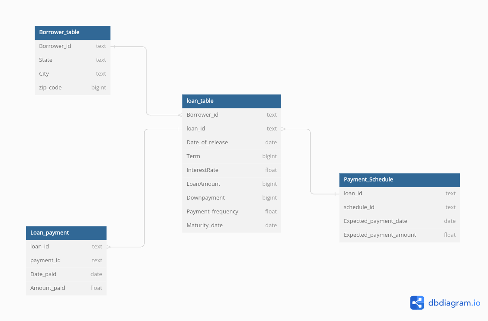

## **Entity Relationship Diagram**

The above ERD diagram was developed to model the data to understand the relationship across tables
to aid easy and effective transformation.

## **Key Implementation Tools**

✅ &nbsp; &nbsp;  <a href='https://python.org'> Python </a>  
✅ &nbsp; &nbsp;  <a href='https://jupyter.org/'> Jupyter Notebook </a>  

## **How to run the Project**

- Create a directory called __data__ in the root directory of the project  

- Upload the different data models in the data directory

- Open the __.ipynb__ file which has following 4 sections:

    - Load the Data and Prepare the Data  >>> This loads all the data in the directory

    - Transform the Data >>> Transforms the data

    - Analyze the Data  >>> This section analyzes the transformed based on expected output

    - Export the Analyzed Result  >>> Exports the analyzed result to xls format

__Also note that cells in each section are to be executed serially, however each run is idempotent__
