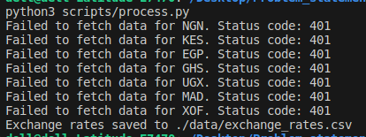
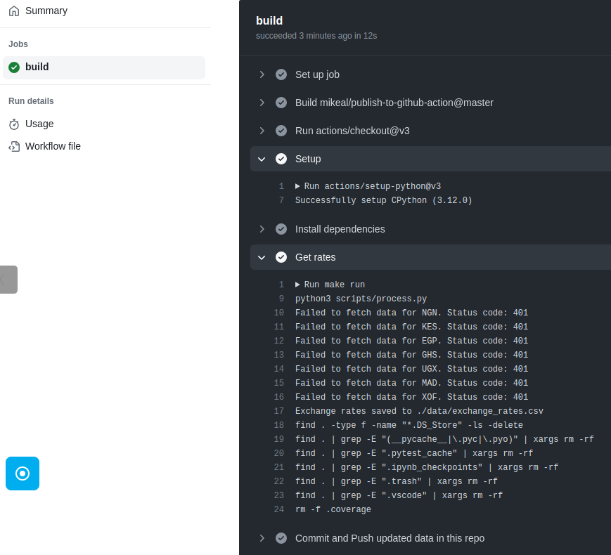

# **Problem Statement-2 (Currency Exchange Rates)**


## **Key Implementation Tools**

✅ &nbsp; &nbsp;  <a href='https://python.org'> Python </a> <br>
✅ &nbsp; &nbsp;  <a href='https://www.gnu.org/software/make/manual/make.html'> GNU Makefile </a><br>
✅ &nbsp; &nbsp;  <a href='https://www.github.com'> Github Actions </a>


## **Installation and setup** 🔩🪛

```bash
make setup
```

The above commands:

* Creates and activate a virtual environmnent (venv) at the current directory
* Installs all listed packages in the __requirements.txt__ file needed to run the application


You can also run the below command to get a list of other command options

```bash
make help
```

## **Importing the Data** 🏬

To run the process of fetching the API data, simply run the following command in your terminal and be sure to export your API_KEY in the terminal prior to running this command.

```
make run
```

## **Configurations for Github Actions** 👨🏽‍💻

Here github actions is used to setup a cron job to fetch and update exchange currency rates twice per day.

**__Steps__**

  - After generating your API_KEY from Xe currency Platform, go to your repository secrets and save as **API_KEY** as key-value pair. This will be needed as an authenticator for making a get requests 

  - Generate a token from your github profile account. This will be needed for the commit actions within the repository as in the case of saving the currency exchange rates data


__Note__ ℹ️:
 
A significant amount of my time was spent trying to get my credit card to be accepted for the API free trial which
keeps getting rejected for some reason and as such I didn't have access to the API_KEY. However their clear documentation helped me alot to still craft out the
this solution and I have also been able to test it by assuming a random api_key and had the below result running from local.





__The result below also shows a successful cron job from github action__

